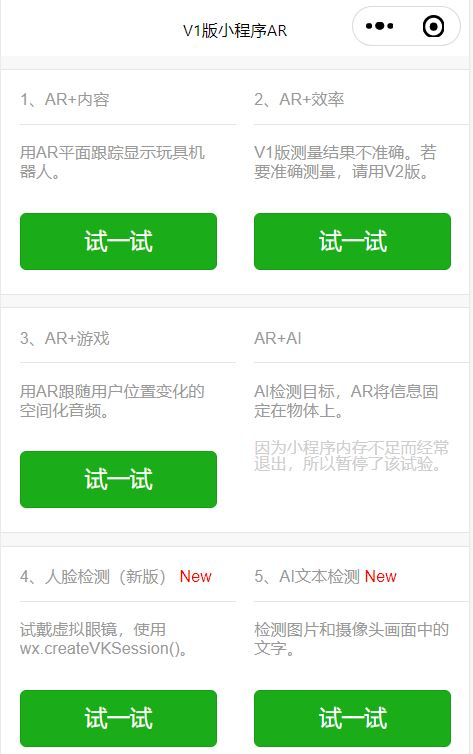
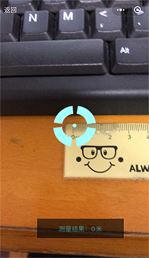
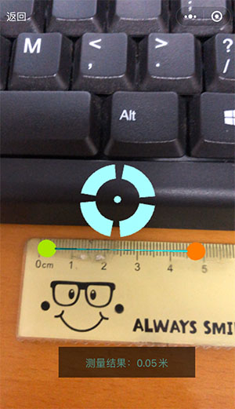
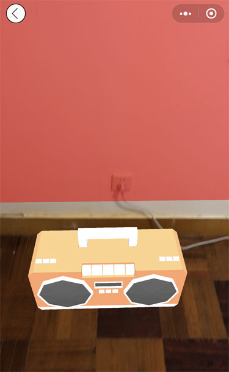
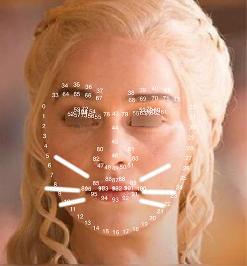
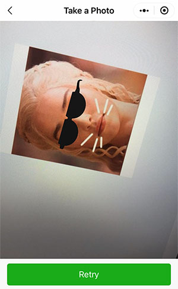

## 更新日志

| 日期　　　| 内容 |
| -- | -- |
| 2022-09-20 | 新增：单样本检测功能。更新：webglBusiness.js升级到官方最新版，也保留了Android深度冲突现象的修复代码。修复：1、在开发者工具预览时，提示超过2MB大小的问题。2、Three.PlaneGeometry、Three.BoxGeometry等的纹理贴图变为黑色，同时画面镜像和闪烁。 |
| 2022-01-05 | 新增：1、AR空间化音频 2、AR+AI图像分类 3、AR玩具机器人增加录制视频功能。|
| 2022-01-01 | 修复：Android手机画面深度冲突的第3种修改方法。 |
| 2021-12-24 | 修复：使用顶部导航条，遮挡Android手机画面的深度冲突现象。 |
| 2021-12-23夜晚 | 更新：1、平面跟踪的3D模型的默认大小可以自定义 2、3D模型从矩阵更新(matrixAutoUpdate=false)变为属性更新(matrixAutoUpdate=true)，这样可以不用矩阵调整3D模型的姿态。 |
| 2021-12-23下午 | 修复：Android手机画面左上角显示雪花的问题 |
| 2021-11-30 | 新增：1、AR试戴眼镜 2、AR测量尺子 3、AR玩具机器人固定在平面上 |


## 介绍

本项目包含以下AR和AI示例。

AR+内容：用AR平面跟踪显示玩具机器人。目录package_world_track。

AR+效率：用AR测量平面上物体的长度。目录package_measure。

AR+游戏：用AR跟随用户位置变化的空间化音频。目录package_spatial_audio。

AI人脸检测：根据AI检测的人脸姿态，将虚拟眼镜佩戴在人脸上。目录package_face_detect。

AR+AI：用AI检测图像中的物体，将名称显示在物体上。目录package_image_classify。

单样本检测：只用一张图片，检测现实环境中目标物体的位置。目录package_oneshot_tracker。

## 引用

视觉算法

https://developers.weixin.qq.com/miniprogram/dev/api/ai/visionkit/wx.createVKSession.html

人脸识别

https://developers.weixin.qq.com/miniprogram/dev/api/ai/face/wx.faceDetect.html

Web Audio空间化音频

https://threejs.org/examples/?q=audio#webaudio_orientation

Tensorflow.js图像分类

https://github.com/tensorflow/tfjs-models/tree/master/mobilenet

单样本检测

https://developers.weixin.qq.com/miniprogram/dev/framework/open-ability/visionkit/osd.html

首页



## AR+内容

机器人稳稳地站在房间地板上


拿着手机左右观看


拿着手机远近观看


动画


## AR+效率

点击屏幕，开始测量。请将光标的位置，对准被测量物体的两端。



再次点击屏幕，结束测量。



## AR+游戏

用户拿着手机走动时，播放器的音量会随着用户的距离变化。在红色平面的后面，播放器的声音消失。



## AR+AI

点击手机屏幕，用AI检测屏幕画面中的物体，将物体名称显示在物体上面。支持1000种物体分类。


## AI人脸检测

106个特征点的位置。本项目使用了索引值78（左眼）和79（右眼）两个特征点。



检测旋转的人脸




## 如何使用

1、使用微信开发者工具，打开项目源代码，在手机上预览。

2、如果遇到模型不加载、图片不显示等状况，请打开小程序的调试模式。

## 如果更换3D模型

在源代码中修改常量robotUrl。

```javascript
  // 机器人模型
  const robotUrl = 'https://m.sanyue.red/demo/gltf/robot.glb';
```
