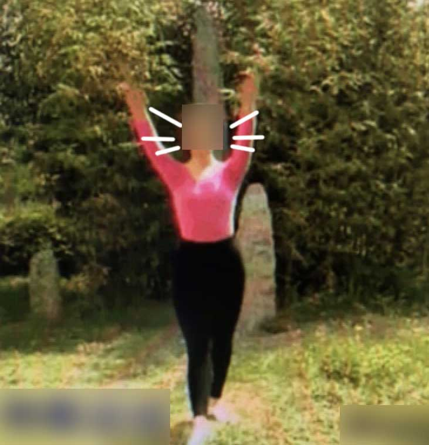

## 更新日志

| 日期　　　| 内容 |
| -- | -- |
| 2022-12-12 | 新增：AI人体检测、AI手部检测、AR图像跟踪等、AR地铁示意图。删除：AI目标分类的package_image_classify目录。旧版AI人脸检测的package_face_detect目录。 |
| 2022-10-27 | 新增：AI人脸检测（新版）、AI文本检测等。 |
| 2022-09-20 | 新增：单样本检测功能。更新：webglBusiness.js升级到官方最新版，也保留了Android深度冲突现象的修复代码。修复：1、在开发者工具预览时，提示超过2MB大小的问题。2、Three.PlaneGeometry、Three.BoxGeometry等的纹理贴图变为黑色，同时画面镜像和闪烁。 |
| 2022-01-05 | 新增：1、AR空间化音频 2、AR+AI图像分类 3、AR玩具机器人增加录制视频功能。|
| 2022-01-01 | 修复：Android手机画面深度冲突的第3种修改方法。 |
| 2021-12-24 | 修复：使用顶部导航条，遮挡Android手机画面的深度冲突现象。 |
| 2021-12-23夜晚 | 更新：1、平面跟踪的3D模型的默认大小可以自定义 2、3D模型从矩阵更新(matrixAutoUpdate=false)变为属性更新(matrixAutoUpdate=true)，这样可以不用矩阵调整3D模型的姿态。 |
| 2021-12-23下午 | 修复：Android手机画面左上角显示雪花的问题 |
| 2021-11-30 | 新增：1、AR试戴眼镜 2、AR测量尺子 3、AR玩具机器人固定在平面上 |


## 介绍

本项目包含以下AR和AI示例。

1、AR+内容：用AR平面跟踪显示玩具机器人。目录package_world_track。

2、AR+效率：用AR测量平面上物体的长度。目录package_measure。

3、AR+游戏：用AR跟随用户位置变化的空间化音频。目录package_spatial_audio。

4、AI人脸检测（新版）：根据AI检测的人脸姿态，将虚拟眼镜佩戴在人脸上。目录package_face_detect_v2。

5、AI文本检测：检测图片和摄像头画面中的文字。目录package_text_detect。

6、AR图像跟踪：用一张图像，检测平面图像的姿态。目录package_image_tracker。

7、AI单样本检测：只用一张图片，检测现实环境中目标物体的位置。目录package_oneshot_tracker。

8、AI人体关键点检测: 检测人体关键点和姿势。目录package_body_detect。

9、AI手部关键点检测：检测手部关键点和手势。目录package_hand_gesture。

10、上海地铁示意图：自然交互地方式查看地图。目录package_plane_track。

## 删除的示例

<s>AI人脸检测（旧版）：根据AI检测的人脸姿态，将虚拟眼镜佩戴在人脸上。目录package_face_detect。</s>（因为官方不再维护旧版API，所以删除。）

<s>AR+AI：用AI检测图像中的物体，将名称显示在物体上。目录package_image_classify。</s>（因为小程序内存不足而经常退出，所以删除。）

## 参考文档

平面跟踪

https://developers.weixin.qq.com/miniprogram/dev/framework/open-ability/visionkit/plane.html

人脸关键点检测（新版）

https://developers.weixin.qq.com/miniprogram/dev/framework/open-ability/visionkit/face.html

文本检测

https://developers.weixin.qq.com/miniprogram/dev/framework/open-ability/visionkit/ocr.html


图像跟踪

https://developers.weixin.qq.com/miniprogram/dev/framework/open-ability/visionkit/marker.html


单样本检测

https://developers.weixin.qq.com/miniprogram/dev/framework/open-ability/visionkit/osd.html


人体关键点检测

https://developers.weixin.qq.com/miniprogram/dev/framework/open-ability/visionkit/body.html

手部关键点和手势检测

https://developers.weixin.qq.com/miniprogram/dev/framework/open-ability/visionkit/hand.html

获取RGBA相机图像

https://developers.weixin.qq.com/miniprogram/dev/api/ai/visionkit/VKFrame.getCameraBuffer.html


首页


## 1、AR+内容

玩具机器人站在房间地板上。


## 2、AR+效率

点击屏幕，开始测量。请将光标的位置，对准被测量物体的两端。


再次点击屏幕，结束测量。


V1版测量结果不准确。若要准确测量，请用V2版。

## 3、AR+游戏

用户拿着手机走动时，播放器的音量会随着用户的距离变化。在红色平面的后面，播放器的声音消失。


## 4、AI人脸检测

106个特征点的位置。本项目使用了索引值78（左眼）和79（右眼）两个特征点。


检测旋转的人脸


## 5、AI文本检测

实时地检测摄像头画面中的中文、英文、数字等。


## 6、AR图像跟踪

识别图


显示玩具机器人


## 7、AI单样本检测

显示方框


## 8、AI人体关键点检测

19个关键点


使用余弦距离，判断第八套广播体操的动作。

伸展运动



扩胸运动


体侧运动


## 9、AI手部关键点检测

21个关键点


使用欧式距离，判断石头剪刀布手势。

布手势


剪刀手势


石头手势


## 10、地铁示意图

将地铁示意图固定在桌面上，像看报纸一样查看地图。


## 如何使用

1、使用微信开发者工具，打开项目源代码，在手机上预览。

2、如果遇到模型不加载、图片不显示等状况，请打开小程序的调试模式。

## 如果更换3D模型

在源代码中修改常量robotUrl。

```javascript
  // 机器人模型
  const robotUrl = 'https://m.sanyue.red/demo/gltf/robot.glb';
```
